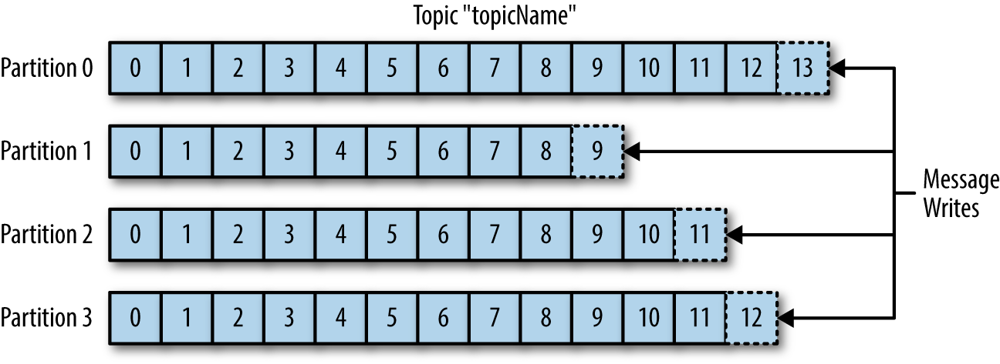
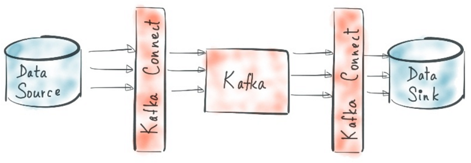

# Kafka Hands-on

[TOC]

这篇教程从Kafka的基础概念入手，通过实际运行一套Kafka集群环境，帮助大家理解Kafka工作原理以及如何有效开发Kafka应用。文中很多内容参考了Kafka官方文档、《Kafka权威指南》和“Kafka最佳实践”培训课程。实验环境需要一台4G以上内存、30G以上硬盘并且已配置好Docker的主机。

## Kafka基础概念

### 主题(Topic)和分区(Partition) 

每个主题至少有一个分区，主题只是一组命名的分区，而分区才是实际上的数据流。应用通常只向主题发送或订阅消息，生产者利用hashcode(消息带有key)或轮询(消息没有key)选择分区存储消息。每个分区内部消息是有序的，通过offset维护消息序号。



### 生产者(Producer)和消费者(Consumer)

**生产者**只需要将消息尽量均衡的写到多个分区上，并不关心具体是哪个分区。但**消费者**需要知道自己应该处理哪个分区上的数据，以便相同**消费群组**中的消费者互不干扰。对于每个消费群组，里面包含的消费者数量需小于分区数量，否则有些消费者将没有分区可以处理。为了均衡消费者的处理能力，通常将分区数量配置为消费者的整数倍。在进行消费者扩容的时候，同时需要线性的对分区扩容。


另外一种扩容策略是饱和式分区，预设足够多的分区，这样在消费者扩容的时候就无需扩容分区，类似Cassandra增加node的时候无需调整分区，很多时候这是个很好的策略，也避免了扩容时key的rehash，但在Kafka里有几个限制条件需要考虑：

- Kafka的消费者是随业务变化而增加的，数量庞大，每个消费者都需要连到对应的分区上，连接以及再均衡开销巨大。当然这里我们可以采用消费者代理，减少消费者数量以提高性能。
- 为了提高性能，Kafka会尽量连续读写磁盘，而不是随机读写。这意味着每个分区拥有自己的专属磁盘性能是最优的，如果多个分区共享同一个磁盘，将无法真正连续读写，影响性能。
- 单个broker能管理的分区是有限的，分区leader的选举是在Zookeeper上顺序执行的，分区越多，完成分区leader选举需要的时间越多，造成可用性下降。

消费群组中的消费者可以自动协调平衡分区信息，但有些特别的消费者需要读取全部或特定分区，这类消费者称为Low level consumer或Standalone consumer，它并不订阅主题，而是直接关联主题中的分区，也不存在消费群组。例如调试工具kafkacat就采用了这种模式。

### Broker和集群结构

Kafka集群中的每一台服务器都称之为broker。broker接收生产者的消息，管理offset，并持久化到磁盘，并响应消费者的请求，同时broker之间需要同步副本数据。这要求Kafka集群网络满足以下要求：

1. 每一个broker都需要和zookeeper通信，获取集群leader和分区leader信息。
2. 每一个broker都需要和其他broker通信，以实现复制。
3. 每一个生产者/消费者都必须能和每一个broker通信，实现消息发送和读取。不同于Cassandra的节点同时可以充当代理，Kafka要求客户端直连分区所在节点。
4. 客户端连接Kafka集群使用bootstrap-server发送的节点信息，请正确配置ADVERTISED_LISTENERS。


在集群内部，某个broker会被选举为集群leader，作为协调者负责将分区分配给broker并监控broker，选举过程简单来说就是抢占 Zookeeper  的 `/controller` 节点。Zookeeper还负责保存所有 kafka 运行状态信息。

### 练习

1. 创建一个新的docker网络给Kafka使用
    ```sh
    docker network create --subnet=172.18.0.0/16 kafka  
    ```

2. 启动Kafka集群，我们这里创建一个3节点的zookeeper集群和一个3节点的Kafka集群。为方便我们从docker外部访问，我们将Kafka同时注册到内部和外部网络地址上，并通过docker proxy暴露给外部。
    ```bash
    IP=`ip a|grep -Eo 'inet (addr:)?([0-9]*\.){3}[0-9]*' | grep -Eo '([0-9]*\.){3}[0-9]*' | grep 192`
    
    docker run --net kafka --ip 172.18.0.2 --name zoo1 --restart always -d -e ZOO_MY_ID=1 \
     -e ZOO_SERVERS="server.1=172.18.0.2:2888:3888 server.2=172.18.0.3:2888:3888 server.3=172.18.0.4:2888:3888" \
     zookeeper:3.4.13
    
    docker run --net kafka --ip 172.18.0.3 --name zoo2 --restart always -d -e ZOO_MY_ID=2 \
     -e ZOO_SERVERS="server.1=172.18.0.2:2888:3888 server.2=172.18.0.3:2888:3888 server.3=172.18.0.4:2888:3888" \
     zookeeper:3.4.13
    
    docker run --net kafka --ip 172.18.0.4 --name zoo3 --restart always -d -e ZOO_MY_ID=3 \
     -e ZOO_SERVERS="server.1=172.18.0.2:2888:3888 server.2=172.18.0.3:2888:3888 server.3=172.18.0.4:2888:3888" \
     zookeeper:3.4.13
    
    docker run --net kafka --ip 172.18.0.5 --name kafka1 -p 9093:9093 -d \
    -e KAFKA_LISTENER_SECURITY_PROTOCOL_MAP=INTERNAL:PLAINTEXT,EXTERNAL:PLAINTEXT \
    -e KAFKA_ADVERTISED_LISTENERS=EXTERNAL://$IP:9093,INTERNAL://172.18.0.5:9092 \
    -e KAFKA_LISTENERS=INTERNAL://:9092,EXTERNAL://:9093 \
    -e KAFKA_INTER_BROKER_LISTENER_NAME=INTERNAL \
    -e KAFKA_ZOOKEEPER_CONNECT="172.18.0.2:2181,172.18.0.3:2181,172.18.0.4:2181" \
    wurstmeister/kafka:2.12-2.0.1
    
    docker run --net kafka --ip 172.18.0.6 --name kafka2 -p 9094:9094 -d \
    -e KAFKA_LISTENER_SECURITY_PROTOCOL_MAP=INTERNAL:PLAINTEXT,EXTERNAL:PLAINTEXT \
    -e KAFKA_ADVERTISED_LISTENERS=EXTERNAL://$IP:9094,INTERNAL://172.18.0.6:9092 \
    -e KAFKA_LISTENERS=INTERNAL://:9092,EXTERNAL://:9094 \
    -e KAFKA_INTER_BROKER_LISTENER_NAME=INTERNAL \
    -e KAFKA_ZOOKEEPER_CONNECT="172.18.0.2:2181,172.18.0.3:2181,172.18.0.4:2181" \
    wurstmeister/kafka:2.12-2.0.1
    
    docker run --net kafka --ip 172.18.0.7 --name kafka3 -p 9095:9095 -d \
    -e KAFKA_LISTENER_SECURITY_PROTOCOL_MAP=INTERNAL:PLAINTEXT,EXTERNAL:PLAINTEXT \
    -e KAFKA_ADVERTISED_LISTENERS=EXTERNAL://$IP:9095,INTERNAL://172.18.0.7:9092 \
    -e KAFKA_LISTENERS=INTERNAL://:9092,EXTERNAL://:9095 \
    -e KAFKA_INTER_BROKER_LISTENER_NAME=INTERNAL \
    -e KAFKA_ZOOKEEPER_CONNECT="172.18.0.2:2181,172.18.0.3:2181,172.18.0.4:2181" \
    wurstmeister/kafka:2.12-2.0.1
    ```

3. 检查内部和外部地址上的Broker情况
    ```sh
    docker run -it --net kafka confluentinc/cp-kafkacat kafkacat -b 172.18.0.5:9092 -L
    docker run -it --net host  confluentinc/cp-kafkacat kafkacat -b $IP:9093 -L
    ```

4. 创建有 2 个partition并且复制因子为 2 的topic并检查topic状态。这个命令需要在Kafka容器内部执行，我们可以通过`docker exec -it kafka1 sh`进入任意一台Kafka容器内部，注意后面所有`kafka`开头的shell都类似的要在Kafka容器内执行。
    ```sh
    kafka-topics.sh --zookeeper 172.18.0.2:2181 --create --topic test01 --replication-factor 2 --partitions 2
    kafka-topics.sh --zookeeper 172.18.0.2:2181 --describe --topic test01
    ```
    应该可以看到类似下面的信息，表明在 Topic test01下面有 0 和 1 两个 Partition，而 partition 0 的 leader 是 1001，并且数据在 1001 和 1002 上存在副本，其中有效副本(in-sync replica set, ISR)是两个。
    ```
    Topic:test01    PartitionCount:2        ReplicationFactor:2     Configs:
    
    Topic: test01   Partition: 0    Leader: 1001    Replicas: 1001,1002     Isr: 1001,1002
    Topic: test01   Partition: 1    Leader: 1002    Replicas: 1002,1003     Isr: 1002,1003
    ```

5. 启动consumer监听topic，下面两个方法是等效的。
    - 使用控制台脚本
     ```sh
     kafka-console-consumer.sh --bootstrap-server 172.18.0.5:9092 --from-beginning --topic test01
     ```
    - kafkacat
     ```sh
     docker run -it --net kafka confluentinc/cp-kafkacat kafkacat -b 172.18.0.5:9092 -C -t test01
     ```

6. 启动producer发送消息。启动下面的脚本或用kafkacat，随意输入些内容回车即可发送。发送同时，我们观察consumer的窗口，可以看到消息被立即接收。
    ```sh
    kafka-console-producer.sh --broker-list 172.18.0.5:9092 --topic test01
    ```
    发完成后查看topic上的offset状态，可以看到offset均匀的分散在两个partition上，该命令输出格式为`topic:partition:offset`
    ```sh
    $> kafka-run-class.sh kafka.tools.GetOffsetShell --broker-list 172.18.0.5:9092 --topic test01
    test01:0:5
    test01:1:4
    ```
    继续检查consumer group状态，可以看到每个分区被哪些消费者连接，已消费的offset，剩余offset等信息
    ```sh
    $> kafka-consumer-groups.sh --bootstrap-server localhost:9092 --list
    console-consumer-99123
    $> kafka-consumer-groups.sh --bootstrap-server localhost:9092 --describe --group console-consumer-99123
    TOPIC           PARTITION  CURRENT-OFFSET  LOG-END-OFFSET  LAG             CONSUMER-ID                                     HOST            CLIENT-ID
    test01          0          5               5               0               consumer-1-3e032c2d-1e86-441a-8eb4-9df38b2d6824 /172.18.0.6     consumer-1
    test01          1          4               4               0               consumer-1-3e032c2d-1e86-441a-8eb4-9df38b2d6824 /172.18.0.6     consumer-1
    ```
7. 最后，对集群做个简单的性能测试，在我笔记本上大概可以跑到 70W 消息/秒。
    ```sh
    kafka-producer-perf-test.sh --topic benchmark --num-records 15000000 --record-size 100 --throughput 15000000 --producer-props bootstrap.servers=172.18.0.5:9092 batch.size=50000 acks=0
    ```

## 可靠性与性能

Kafka作为消息系统有很多机制保证消息的可靠投递，但所有这些机制都会对性能有负面影响，我们应该根据自己的应用场景合理选择。

### 复制
每个分区都有一个归属broker称为分区leader，生产者需要直连该broker发送消息，分区leader会立即将消息持久化到磁盘。为防止分区leader意外宕机造成消息丢失，通常会设置消息副本，副本数量由topic 的ReplicationFactor决定。前面我们已经通过 `kafka-topics.sh --describe` 命令观察过分区的副本信息。那什么时候发生复制呢？这取决于几个因素：

- 生产者的 acks 配置。acks 可以配置为 
    - 0 ：生产者根本不等待broker的确认。这时分区leader都不一定能收到消息，副本就更不确定了。
    - 1 ：生产者等待分区leader确认，这也是acks的默认值。
    - all/-1 ：分区leader在确认前会等待所有 In-Sync Replicas(ISR) 节点完成复制。这个时候Kafka能最大程度保障消息不会丢失。
- In-Sync Replicas(ISR) 集合。为了保证消息不会丢失，复制策略通常有两种。一是 quorum-based，即写和读都需要等待 quorum 数量的节点，从而确保不会读到过期数据，Zookeeper 和 Cassandra 都是采用这样的策略。第二就是Kafka采用的 "all" 模式。显然真正的all会引起极大的延迟，所以Kafka引入了 ISR 的概念，ISR节点是那些同步速度能够跟上leader的follower ，如果follower同步过慢，将会从ISR列表移除，分区leader只等ISR列表中的followers应答即可认为完成all同步。注意，此时follower仅仅将消息存储在了内存，在极端情况下仍可能丢失消息。如果所有的follower都无法跟上leader，显然leader宕机将会导致数据丢失，这时可以通过设置 `min.insync.replicas` 以牺牲可用性来提高一致性。

### Offset管理

Consumer消费消息之后，需要将已消费的offset提交到broker，这样当consumer宕机的时候，消费群组的其他consumer可以从正确的位置开始消费。Offset的提交发生在每次 `poll()` 消息的时候，或者达到提交的最大间隔时间。特别需要注意的是，手动执行 `consumer.commitSync()` 其提交的offset仍然是 `poll()` 返回的批量记录，如果需要提交单条记录的offset需要使用 `commitSync(offsets)` 方法。

消费者可以自行指定offset，消费topic中的任意一条记录，但通常我们使用两种模式的 `auto.offset.reset` 以简化开发:

- latest: 消费分区上的最后一条offset
- earliest: 消费分区在当前消费群组里的最后一条offset

### Rebalance

当有consumer加入或离开**群组**的时候，或者分区数量发生变化的时候，每个consumer处理的分区将发生调整，这个过程称为rebalance。rebalance提高了系统的容灾能力，但也带来一些问题：

- consumer 短期失效，降低消费能力
- 如果手动 offset 提交，rebalance后连到了不同partition，造成提交失败，导致重复消费。通过注册 `ConsumerRebalanceListener.onPartitionsRevoked()` 方法及时刷新offset可以减少问题，但据说无法完全避免。
- rebalance的时候每个分区需要等待旧consumer断开，再跟新consumer连接，如果分区数量过多rebalance可能长达数十秒，一般分区需要控制在数千个以内。

显然除非必要，我们应该尽量避免rebalance的发生，所有有几种非正常rebalance需要特别关注。

1. 心跳丢失。Kafka通过 `heartbeat.interval.ms`(fetch的时候也会发心跳) 和 `session.timeout.ms` 来判断consumer是否超时意外下线，当主机CPU或IO负载很高的时候，例如流式处理中很容易出现心跳丢失，导致频繁rebalance。解决思路主要是不要将心跳设得太短，并延长timeout时间。
2. poll 间隔超时。Kafka中一个典型的消费过程是这样的：consumer连上分区leader，根据 `"max.partition.fetch.bytes"` 等参数从leader拉取数据并存入本地队列，应用调用 `poll()` 方法依据 `"max.poll.records"` 返回记录集，处理完成后再次调用 `poll()` 处理下一批数据。但两次 poll 之间是有处理时长要求的，默认不超过 30 秒，否则该consumer将被踢走并发生rebalance。解决自然也是加快 poll 速度，例如先存本地队列再实际消费，减少 poll 大小或者延长超时。
3. GC过久导致超时。

Consumer能自动rebalance是否就足够了呢？想象一下当 broker 重启的时候会发生什么。一个broker离线时其所有的分区leader会转移到其他broker，等它再次上线，它所有的分区都自动进入follower状态，但客户端永远只跟分区leader通信，意味着这个broker将没有任何traffic。这时需要设置 `auto.leader.rebalance.enable = ture` 或手工利用 [Preferred Replica Leader Election Tool](https://cwiki.apache.org/confluence/display/KAFKA/Replication+tools#Replicationtools-1.PreferredReplicaLeaderElectionTool) 进行分区leader选举，以平衡broker的负载。同理，新的broker加入集群也不会处理任何数据，直到创建了新分区或者 [reassign partitions](https://cwiki.apache.org/confluence/display/KAFKA/Replication+tools#Replicationtools-4.ReassignPartitionsTool) 。


### 消息传递保证

对于消息系统，我们必须讨论消息投递可靠性保证，Kafka 提供了3种级别的保证。

1. *at-most-once*<br/>
用于对丢消息并不敏感的场景，比如IoT设备的传感器数据，反正数据会不断发上来，少量丢失不影响业务。其配置通常为 `enable.auto.commit = true`，consumer只管消费，性能最好。

2. *at-least-once*<br/>
这个时候需要关闭 auto.commit，并在处理完一批 `poll()` 的数据后手工 commit。如果发生consumer宕机或rebalance，可能会有部分已处理的记录还没commit，下个consumer连进来的时候会重复消费。这时通过外部系统管理offset，并利用Hbase/Redis存储消息并查重，可以防止重复消费。

3. *exactly-once*<br/>
在上面的 *at-least-once* 模式下，配合外部查重，可以保证consumer正好一次的消费，但producer不能保证消息正好一次的投递。Kafka从 0.11 开始支持 *exactly-once*，为实现这一点Kafka引入了两个特性：
    - 幂等发送。通过启用producer上的 `enable.idempotence`，每个producer发送的消息都会带上一个单调递增的序列号，broker一旦发现序号错误将会拒绝消息，这样producer就会知道消息出现重复或乱序，对应处理。
    - 事务性提交和读取。每个producer由用户提供一个永远不变而唯一的 `transactional.id`，Kafka保证在同一个 `transactional.id` 上同一事务内的多个写操作具有原子性。同时在consumer上启用 `isolation.level = read_committed` 保证只读到producer上已提交的数据，从而可以保证consumer只会读到producer以 *exactly-once* 模式发送的消息。


### 性能优化小结

结合上面的理论知识，我们总结一下Kafka在性能优化上的思路方向。

- Producer优化
    - 设置acks级别
    - 启用传输压缩(compression.type = gzip)，这是个以CPU换网络IO的优化方案
    - 优化消息大小，越小的消息发送性能越高，比如只传输最关键key值，消息整体从HBase读取。
    - 调整batch和buffer的大小
    - 调整 `linger.ms`，通过延迟消息发送以获得更好的批处理能力

- Consumer优化
    - 避免Rebalance
    - Consumer扩容的时候partition线性扩容
    - 控制Consumer的数量，避免全部直连broker

- Broker 优化
    - 针对topic的不同应用场景，优化分区和副本的设置
    - 消息存储压缩(Lz4/Gzip/Snappy)
    - 分区会优先扩容在分区数量较少的磁盘目录上，配置多个 `log.dirs` 分别指向多个裸盘，让分区均衡到裸盘上以最大化连续读写能力，据说效果比raid好
    - XFS比EXT4可能有更好的性能
    - 操作系统的一些调优，例如文件描述符数量、socket 缓冲区大小、`vm.max_map_count` 数量等等。

## Kafka的特性

### 应用场景

Kafka最初被创建是因为 Linkedin 需要一个消息总线，所以从一开始就有消息持久化和重复消费能力。但Kafka极高的写入性能，在分区上的顺序消费能力，也极为适合处理请求削峰。然后Kafka存储的线性扩容能力，使得不管存储多少消息，读取性能都是接近的，这使得Kafka也很适合作为存储系统使用。最后Kafka近乎实时的消息处理能力让它在现在流式处理的风潮下宣称自己也是streaming platform。那我们将Kafka分别应用于这些场景的时候，又有哪些优势和局限呢。

Kafka 使用中最需要避免高连接数下的高吞吐，因为高吞吐容易引起timeout从而引发rebalance，而高连接数下的rebalance可能会持续很久，造成系统长时间不可用，消息重复和丢失。所以我们可以从两个方向划分场景：

1. 可靠数据传输 / 流式系统 / 削峰 / 日志
    - 尽量设计为低并发，高流量，高吞吐
    - 避免直连，比如利用Netty做连接代理，降低并发

2. 状态通知 / 消息系统 / 解耦
    - 尽量设计为高并发，低流量，降低消息尺寸，数据共享Redis
    - 实现动态扩容

3. 有序消息传递
    - 使用单一分区
    - 或接受消息后排序[Redis]

### 其他类似服务

Hadoop-HDFS：海量数据存取

HBase：基于hadoop，海量数据高性能检索，不支持复杂查询，高性能并发写入

mongo：CURD，复杂检索，无事务(事务实现锁严重，严重影响性能)，不超过 100G，10G内较好

Redis：热点数据处理/秒杀 + 极高数据检索性能

Hadoop-MR：数据预处理 清洗，去噪，格式化，标准化

Spark SQL：多维数据分析。硬件要高配CPU和大量内存，对存储要求低

Storm/Flink:  实时数据处理，复杂微批（Storm），SQL微批（Flink），现在流行用Flink代替Storm

Spark Streaming: 微批，秒级延迟


## 发送和接收消息

### Java API 接口

Java API的使用可以直接参考API手册，使用上比较简单，这里不给例子了。

- https://kafka.apache.org/20/javadoc/org/apache/kafka/clients/producer/KafkaProducer.html
- https://kafka.apache.org/20/javadoc/org/apache/kafka/clients/consumer/KafkaConsumer.html

### Connect API

Kafka Connect用于建立Kafka和其他系统之间的可靠流式传输。例如我们使用MQTT Connect连接MQTT Broker，从而方便的将IoT设备信息存储在Kafka。



我们跑一个Kafka自带的例子将标准输入流写入topic中，体验下connect的能力。首先打开consumer监听topic。
```sh
kafka-console-consumer.sh --bootstrap-server localhost:9092 --from-beginning --topic connect-test
```
建立一个 console-source 类型的 connect，并向console随意写入些数据，我们将在consumer的控制台上看到消息输出。
```sh
connect-standalone.sh ../config/connect-standalone.properties ../config/connect-console-source.properties
```

### Spring-kafka

Spring kafka 提供了非常简单的API接口，一个典型的consumer只需要在properties中配置相应的连接属性，然后以Listener的形式按条消费记录。
```properties
demo.topic=TestMsg01
spring.kafka.bootstrap_servers=192.168.56.111:9093
spring.kafka.listener.ack_mode=MANUAL_IMMEDIATE
spring.kafka.consumer.group_id=demo-consumer-group
spring.kafka.consumer.auto_offset_reset=earliest
spring.kafka.consumer.enable_auto_commit=false
```

```java
@KafkaListener(topics = "${demo.topic}")
public void consumer(ConsumerRecord<String, String> consumerRecord, Acknowledgment
		acknowledgment, Consumer consumer) throws InterruptedException {
    String msg = consumerRecord.value();
    System.out.println(msg);
    acknowledgment.acknowledge();
}
```

### Stream API

Kafka Stream为了实现状态的概念，抽象了两种实体KStream， KTable
- KStream等同于数据库中Change log
- KTable等同于数据库在一个时间点Snapshot，两个不同的Snapshot之间通过1个或多个changelog造成

Stream的编程模型就变成了描述如何从stream汇聚数据成table，以及定时刷新表的快照到输出topic。下面的官方例子展现了如何统计输入topic中所有单词出现的次数，并将结果写入输出topic。

```java
public static void main(String[] args) {
    Properties config = new Properties();
    config.put(StreamsConfig.APPLICATION_ID_CONFIG, "wordcount-application");
    config.put(StreamsConfig.BOOTSTRAP_SERVERS_CONFIG, "192.168.56.111:9093");
    config.put(StreamsConfig.DEFAULT_KEY_SERDE_CLASS_CONFIG, Serdes.String().getClass());
    config.put(StreamsConfig.DEFAULT_VALUE_SERDE_CLASS_CONFIG, Serdes.String().getClass());
    config.put(StreamsConfig.COMMIT_INTERVAL_MS_CONFIG, 10000);

    StreamsBuilder builder = new StreamsBuilder();
    KStream<String, String> textLines = builder.stream("SendWords", 
                             Consumed.with(Serdes.String(), Serdes.String()));
    KTable<String, Long> wordCounts = textLines
      .flatMapValues(textLine -> Arrays.asList(textLine.toLowerCase().split("\\W+")))
      .groupBy((key, value) -> value)
      .count(Materialized.as("counts-store"));
    wordCounts.toStream().to("CountSendWordsNum", 
                             Produced.with(Serdes.String(), Serdes.Long()));

    KafkaStreams streams = new KafkaStreams(builder.build(), config);
    streams.start();
}
```
通过 console-consumer 监听输出topic即可看到统计结果。
```sh
kafka-console-consumer.sh --bootstrap-server localhost:9092 --from-beginning \
   --topic CountSendWordsNum --formatter kafka.tools.DefaultMessageFormatter \
   --property print.key=true \
   --property key.deserializer=org.apache.kafka.common.serialization.StringDeserializer \
   --property value.deserializer=org.apache.kafka.common.serialization.LongDeserializer
```

## 维护
### 原则
- Kafka的新旧版本很可能不兼容，不要混用。即使技术上可行，也会失去zero-copy和额外的内存消耗。
- 旧版本bug很多，尽量用最新的稳定版
- 任何部署方式变化都需要仔细测试，除了kafka自身的数百个参数，JVM、OS、硬件参数都会影响性能

### Zookeeper 结构

Kafka利用zookeeper实现集群选举，并存储 broker 和 topic 的配置信息。可以通过直接访问zookeeper来检查集群状态并修改集群配置。
```
/
|-- brokers
|   |-- ids
|   |   |-- 1001  # 节点名是broker id，存储broker的endpoint等相关信息
|   |   |-- ...
|   |   `-- 1002
|   `-- topics
|       |-- topic_name_01       # topic的id
|       |   `-- partitions
|       |       |-- 0/state     # topic下的分区信息
|       |       `-- 1/state
|       |-- ...
|       `-- __consumer_offsets  # 一个特殊的压缩topic，记录每个consumer group提交的offset情况
|-- cluster/id    # 集群id
|-- consumers     # 早期版本存储consumer group的信息，从0.9开始consumer不再连接zookeeper
|-- controller    # 存储集群leader的broker id
|-- controller_epoch    # 类似Raft中的term，follower可以据此拒绝旧的leader
`-- config
    |-- brokers   # 下面每个子节点是一个broker的配置信息
    `-- topics    # 每个topic的配置信息
```
列出目录树：`zookeepercli -servers 172.18.0.2 -c lsr /`
数据schema参考: https://cwiki.apache.org/confluence/display/KAFKA/Kafka+data+structures+in+Zookeeper

### 监控

Kafka的主流监控工具是 Prometheus 或自行通过 JMX 接口获取状态信息，例如Kafka-Manager。Kafka 官网有各个监控指标的解释。

Prometheus + Grafana:  https://medium.com/@danielmrosa/monitoring-kafka-b97d2d5a5434

kafka-manager: https://github.com/yahoo/kafka-manager

### 清理

Kafka通过配置 Log Retention Policy 通常不用关心消息占用太多磁盘空间。清理策略有基于保留时间的 `log.retention.hours` 和基于文件大小的 `log.retention.bytes`，根据需要在 broker 的 `server.properties` 里指定。

另外从 1.0.0 开始，默认会启用 `delete.topic.enable`，当删除topic的时候，对应的磁盘文件也会被删除。


## 参考资料

kafka的网络结构:
https://github.com/wurstmeister/kafka-docker/wiki/Connectivity

Kafka Listeners - Explained 非常详细的讲清楚了kafka的监听:
https://rmoff.net/2018/08/02/kafka-listeners-explained/

两种consumer的区别:
https://stackoverflow.com/questions/26485329/kafka-high-level-vs-low-level-consumer

Kafka的复制机制:
https://cwiki.apache.org/confluence/display/KAFKA/Kafka+Replication

Exactly Once Delivery and Transactional Messaging in Kafka:
https://docs.google.com/document/d/11Jqy_GjUGtdXJK94XGsEIK7CP1SnQGdp2eF0wSw9ra8/edit

Announcing Kafka Connect: Building large-scale low-latency data pipelines:
https://www.confluent.io/blog/announcing-kafka-connect-building-large-scale-low-latency-data-pipelines/

Kafka: The Definitive Guide:
https://www.oreilly.com/library/view/kafka-the-definitive/9781491936153/ch01.html

Kafka FAQ:
https://cwiki.apache.org/confluence/display/KAFKA/FAQ

解读 2018  13 家开源框架谁能统一流计算:
[https://www.infoq.cn/article/6BqXiEOVLHPwAeCp*WiF](https://www.infoq.cn/article/6BqXiEOVLHPwAeCp*WiF)

<br/>
### Useful commands

- Clean docker containers in test environment
```sh
docker ps -a -q | xargs docker stop
docker ps -a -q | xargs docker rm -v
```

- 手工启动Kafka
```sh
kafka-server-start.sh -daemon ../config/server.properties
```


**Kafka Topics**
- List existing topics
```bash
bin/kafka-topics.sh --zookeeper localhost:2181 --list
```


- Purge a topic
```bash
bin/kafka-topics.sh --zookeeper localhost:2181 --alter --topic mytopic --config retention.ms=1000
```
  ... wait a minute ...

```bash
bin/kafka-topics.sh --zookeeper localhost:2181 --alter --topic mytopic --delete-config retention.ms
```

- Delete a topic
```bash
kafka-topics.sh --zookeeper localhost:2181 --delete --topic mytopic
```

- Get the earliest offset still in a topic
```bash
bin/kafka-run-class.sh kafka.tools.GetOffsetShell --broker-list localhost:9092 --topic mytopic --time -2
```

- Get the latest offset still in a topic
```bash
bin/kafka-run-class.sh kafka.tools.GetOffsetShell --broker-list localhost:9092 --topic mytopic --time -1
```

- Consume messages with the console consumer
```bash
bin/kafka-console-consumer.sh --new-consumer --bootstrap-server localhost:9092 --topic mytopic --from-beginning
```

- Get the consumer offsets for a topic
```bash
kafka-consumer-offset-checker.sh --zookeeper=localhost:2181 --topic=mytopic --group=my_consumer_group
```

- Read from __consumer_offsets

Add the following property to `config/consumer.properties`:  `exclude.internal.topics=false`

```bash
kafka-console-consumer.sh --consumer.config config/consumer.properties --from-beginning --topic __consumer_offsets --zookeeper localhost:2181 --formatter "kafka.coordinator.GroupMetadataManager\$OffsetsMessageFormatter"
```

**Kafka Consumer Groups**

- List the consumer groups known to Kafka
```bash
kafka-consumer-groups.sh --zookeeper localhost:2181 --list                         # old api
```

```bash
kafka-consumer-groups.sh --new-consumer --bootstrap-server localhost:9092 --list   # new api
```

- View the details of a consumer group 
```bash
kafka-consumer-groups.sh --zookeeper localhost:2181 --describe --group <group name>
```

**kafkacat**

- Getting the last five message of a topic
```bash
kafkacat -C -b localhost:9092 -t mytopic -p 0 -o -5 -e
```

