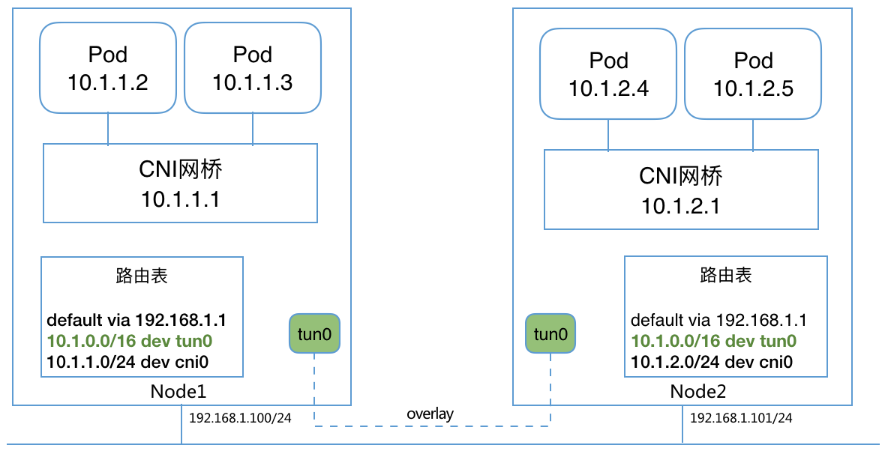

:numbered:
:toc:

# Kubernetes 负载均衡机制
https://chenhm.com

## CNI 工作机制

Kubernetes 在多个网络层面提供了负载均衡能力，但在讲负载均衡之前，我们先看下Kubernetes的网络是如何建立的。由于网络实现的复杂性，
https://github.com/containernetworking/cni/blob/master/SPEC.md[CNI规范]其实是个非常开放的标准，它主要定义了网络插件的输入输出行为，比如都是可执行文件，从环境变量读取标准参数，从stdin读取json格式的网络参数，并将执行结果返回到stdout。CNI的行为主要有两种类型：

- 网络配置，例如建立网桥、设置路由等等，支持 `ADD`, `DEL`, `CHECK`, `VERSION` 等操作
- IPAM(IP Address Management) IP地址分配

https://github.com/containernetworking/plugins[官方插件]目前分成三类：

- main: 创建网络接口
* loopback: 创建lo网卡
* bridge: 将容器连到虚拟交换机上，类似docker的默认的bridge
* macvlan: 使用 macvlan 技术，从某个物理网卡虚拟出多个虚拟网卡，它们有独立的 ip 和 mac 地址
* ipvlan: 和 macvlan 类似，区别是虚拟网卡有着相同的 mac 地址
* ptp: 通过 veth pair 在容器和主机之间建立通道

- ipam: 分配 IP 地址
* host-local: 基于本地文件的 ip 分配和管理，把分配的 ip 地址保存在文件中
* dhcp: 从已经运行的 DHCP 服务器中获取 ip 地址

- meta: 其他插件
* flannel: 使用flannel配置信息创建bridge
* portmap: 利用iptables将host流量转发到container

一个典型的网络创建过程如下:
[plantuml]
----
Kubelet -> containerd: create pod and\nnetwork namespace
containerd -> "CNI bridge" as bridge: call cni to add bridge
bridge -> "CNI ipam" as ipam: call ipam to assign ip
----

Pod网络建好之后，CNI插件还会建立跨主机网络，例如flannel会设置L2 overlay和相应的路由。至此，跨主机的pod通讯网络得以建立。

.from https://kubernetes.feisky.xyz/extension/network/cni


## Service

Kubernetes 的网络服务都是以service为基础，它是一组pod ip的抽象，属于3层ip转发。service本身提供了负载均衡能力，主要有 `kube-proxy` 和 `load balancer` 两种实现方式。

### kube-proxy

kube-proxy类型的service会被分配一个Cluster IP，每台node上的 kube-proxy 进程都会监视符合Selector条件的后端pod状态，通过设置iptables或ipvs将IP包转发到pod ip。如果service type是 `NodePort`, kube-proxy还会设置规则将主机上的对应端口转发到Cluster IP。目前kube-proxy默认的工作模式是iptables，但iptables只能做unweighted round-robin模式的负载均衡，如果需要在service层做更复杂的均衡算法必须使用ipvs。

[plantuml]
----
skinparam handwritten false
skinparam {
    defaultTextAlignment center
    shadowing false
    arrowColor #46749F
    RectangleBorderColor #CCCCCC
    RectangleBackgroundColor #F5F2F0
    ComponentBorderColor #46749F
    ComponentBackgroundColor #E5ECF0
    UsecaseBorderColor #46749F
    UsecaseBackgroundColor #E5ECF0
    ControlBorderColor #0081C6
    ControlBackgroundColor #55DDCA
    frameBorderColor #0081C6
    packageBorderColor #0081C6
    AgentBorderColor #468847
    AgentBackgroundColor #DFF0D8
}

agent "External load balancer" as lb
rectangle "Node"{
    agent "kube-proxy\n(Listen node port)" as proxy
    agent "Backend Pod 1" as pod1
    agent "Backend Pod 2" as pod2
    cloud "Cluster IP\n(iptables/ipvs)" as service
    agent "Internal client" as Client
}
rectangle "Node" as node2{
    agent "kube-proxy\n(Listen node port)" as proxy2
    cloud "Cluster IP\n(iptables/ipvs)" as service2
    agent "Backend Pod 3" as pod3
}
Client --> service
proxy --> service
service --> pod1
service --> pod2
service --> pod3
lb --> proxy
lb ..> proxy2
proxy2 ..> service2
service2 ..> pod1
service2 ..> pod2
service2 ..> pod3
----

很多后端服务是跟session相关的，如果在ip层做round-robin会导致session丢失，这个时候可以设置 `service.spec.sessionAffinity` 为 `ClientIP` 来启用基于源ip的会话粘连。但由于外部客户端必须通过 node port 访问集群，为防止单点故障，通常还需要在集群外部部署 Load balancer， 将流量转发到不同Node，这个时候在外部负载均衡器上也需要设置会话粘连。不过有些负载均衡器本身也是个集群，拥有多个ip，这样基于源ip的sessionAffinity就没用了。

关于iptables 还是 IPVS 的选择可以参考 https://blog.fleeto.us/post/iptables-or-ipvs/[kube-proxy 模式对比]。

### Load balancer

我们看到在kube-proxy模式下，从外部负载均衡器访问pod需要通过node port转发，所以实际产生了2层负载均衡，一层在外部负载均衡器，一层在kube-proxy。这也造成了节点间额外的水平流量。而 Load balancer 类型的 service 则可以让上层设备直连对应node。

#### BPG协议

如果上层路由支持BPG协议，我们可以使用一个独立的网段为service分配一个External IP，这个External IP类似虚拟IP，通过BPG协议通告给上层路由，建立这个虚IP到实际node的路由。在开源实现 https://github.com/metallb/metallb[MetalLB] 中，MetalLB会监控pod列表，并通过speaker组件向上层路由更新路由表。

[plantuml]
----
skinparam handwritten false
skinparam {
    defaultTextAlignment center
    shadowing false
    arrowColor #46749F
    RectangleBorderColor #CCCCCC
    RectangleBackgroundColor #F5F2F0
    ComponentBorderColor #46749F
    ComponentBackgroundColor #E5ECF0
    UsecaseBorderColor #46749F
    UsecaseBackgroundColor #E5ECF0
    ControlBorderColor #0081C6
    ControlBackgroundColor #55DDCA
    frameBorderColor #0081C6
    packageBorderColor #0081C6
    AgentBorderColor #468847
    AgentBackgroundColor #DFF0D8
}

cloud {
    agent "External client" as client
    agent "Load balancer service\n(External IP)" as service
    control "BPG Router" as router
    client --> service
    service --> router
}

cloud {
rectangle "Node"{
    cloud "kube-proxy" as service1
    agent "Backend Pod 1" as pod1
    agent "Backend Pod 2" as pod2
}
rectangle "Node" as node2{
    cloud "kube-proxy" as service2
    agent "MetalLB speaker" as speaker
    agent "Backend Pod 3" as pod3
}
}

router --> service1
router --> service2
router <... speaker: " update NLRI"
service1 --> pod1
service1 --> pod2
service2 --> pod3
----

NOTE: MetalLB 的BPG协议支持 `Cluster` 和 `Local` 两种策略，只有 `Local` 才能避免水平流量，参考 https://metallb.universe.tf/usage/

#### Gratuitous ARP

如果没有BPG路由，MetalLB使用了一个简单的方法，直接在二层网络发送Gratuitous ARP，将External IP和实际node的mac地址绑定，这样也可以让上层路由找到对应的node。但这个方案有明显的缺点，一是External IP必须在上层网络的网段里面，可能需要保留大量ip供service使用，二是Gratuitous ARP并不是个可靠的负载均衡协议。

## Ingress controller

上面讲都是在3层网络上的负载均衡，而更常用的7层负载均衡在k8s中是通过Ingress实现的。Ingress可以通过service selector获得pod列表，形成一致性hash环，然后根据配置的均衡策略直接转发请求到后端。k8s 自身维护了一个基于 openresty(nginx) 的 ingress controller，controller本身也需要通过service暴露到外部（我更喜欢部署为DaemonSet直接监听在主机网络上），其网络结构大致如下：

[plantuml]
----
skinparam handwritten true
skinparam {
    defaultTextAlignment center
    shadowing false
    arrowColor #46749F
    RectangleBorderColor #CCCCCC
    RectangleBackgroundColor #F5F2F0
    ComponentBorderColor #46749F
    ComponentBackgroundColor #E5ECF0
    UsecaseBorderColor #46749F
    UsecaseBackgroundColor #E5ECF0
    ControlBorderColor #0081C6
    ControlBackgroundColor #55DDCA
    frameBorderColor #0081C6
    packageBorderColor #0081C6
    AgentBorderColor #468847
    AgentBackgroundColor #DFF0D8
}

agent "Load balancer" as lb
rectangle "Node"{
    agent "kube-proxy\n(Listen node port)" as proxy
    agent "Ingress Control 1" as ingress1
    agent "Backend Pod 1" as pod1
    agent "Backend Pod 2" as pod2
}
rectangle "Node" as node2{
    agent "kube-proxy\n(Listen node port)" as proxy2
    agent "Ingress Control 2" as ingress2
    agent "Backend Pod 3" as pod3
}
proxy --> ingress1: ip session affinity
lb --> proxy
lb ..> proxy2
proxy2 ..> ingress2
ingress1 --> pod1: http session affinity
ingress1 --> pod2
ingress1 --> pod3
ingress2 ..> pod1
ingress2 ..> pod2
ingress2 ..> pod3
----

在前面我们介绍过IP层的session affinity往往是不可用的，利用 ingress-nginx 则可以基于cookie实现HTTP session affinity，这对于很多web应用都是必须的。

```yaml
kind: Ingress
metadata:
  annotations:
    nginx.ingress.kubernetes.io/affinity: cookie
    nginx.ingress.kubernetes.io/session-cookie-expires: "172800"
    nginx.ingress.kubernetes.io/session-cookie-max-age: "172800"
    nginx.ingress.kubernetes.io/session-cookie-name: route
```

但在早期版本中，如果http请求没设置host头，sticky将无法启用，可以用initContainers修改lua脚本强制启用。

```yaml
initContainers:
  - name: init-runner-volume
    image: quay.io/kubernetes-ingress-controller/nginx-ingress-controller:0.25.0
    command: ["sh", "-c"]
    args:
      - |
        cp -r /etc/nginx/lua/* /etc/nginx/lua_custom
        sed -i '117s/false/true/' /etc/nginx/lua_custom/balancer/sticky.lua
    volumeMounts:
      - mountPath: /etc/nginx/lua_custom
        name: config
```

[bibliography]
## 参考
- https://itnext.io/kubernetes-network-deep-dive-7492341e0ab5
- https://mauilion.dev/posts/kind-metallb/
- https://kubernetes.io/docs/tasks/debug-application-cluster/debug-service[kubernetes debug-service]
- https://www.stackrox.com/post/2020/01/kubernetes-networking-demystified/[Kubernetes Networking Demystified] 有张漂亮的图介绍了iptables在service层怎么转发的
- https://ieevee.com/tech/2019/06/30/metallb.html
